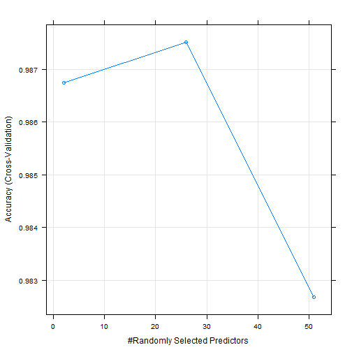

## Introduction

One thing that people regularly do is quantify how much of a particular activity they do, but they rarely quantify how well they do it.

The goal of your project is to predict the manner in which they did the exercise. This is the "classe" variable in the training set. You may use any of the other variables to predict with. You should create a report 

1. describing how you built your model
2. how you used cross validation
3. what you think the expected out of sample error is
4. you will also use your prediction model to predict 20 different test cases.

The rows are the 'arrays' and the columns are the things measured.


## Analysis Outline
#### * [0] Setup
  + [A] Retrieve Data
  + [B] Clean Data
  + [C] Partition training set into 60-40 train-test cross validation
  
#### * [1] describing how you built your model - Prediction Model by Random forest
#### * [2] how you used cross validation - Performance of Random forest model
#### * [3] what you think the expected out of sample error is
#### * [4] you will also use your prediction model to predict 20 different test cases

---

## [0] Setup

### [0.A] Retrieve Data


```r
library(caret)
library(randomForest) 
library(e1071)

trainUrl <- "http://d396qusza40orc.cloudfront.net/predmachlearn/pml-training.csv"
testUrl <- "http://d396qusza40orc.cloudfront.net/predmachlearn/pml-testing.csv"

training <- read.csv(url(trainUrl), na.strings=c("NA","#DIV/0!",""))
testing <- read.csv(url(testUrl), na.strings=c("NA","#DIV/0!",""))

remove(trainUrl, testUrl)
```

### [0.B] Clean


```r
# first off, the data is cleaned off variance near zeroes
nearzero <- nearZeroVar(training, saveMetrics=TRUE)
trainingFilt <- training[, !nearzero$nzv]

nearzero <- nearZeroVar(testing, saveMetrics=TRUE)
testingFilt <- testing[, !nearzero$nzv]

# make sure the tested variables are the same
trainingFilt <- trainingFilt[ ,names(trainingFilt) %in% names(testingFilt)]
testingFilt <- testingFilt[ ,names(testingFilt) %in% names(trainingFilt)]
# add back classe column
trainingFilt <- cbind(trainingFilt, classe = training$classe)

# second we will remove the identifier information - row number, usernames, timestamps, window
trainingFilt <- trainingFilt[ , -c(1:7)]
testingFilt <- testingFilt[ , -c(1:7)]

dim(trainingFilt)
```

```
## [1] 19622    52
```

```r
dim(testingFilt)
```

```
## [1] 20 51
```

### [0.C] Partition training set
Remember that we split 60% training and 40% testing. Unless large dataset, then 80% training and 20% testing.


```r
indexTrain <- createDataPartition(y = trainingFilt$classe, p=6/10, list=FALSE)
keepForTrain <-trainingFilt[indexTrain, ]
keepForTest <- trainingFilt[-indexTrain, ]
```

---

## [1] describing how you built your model

### Prediction Model by Random forest

Using the 60% split for training, we will build a prediction model. Random forest was the selected choice due to its accuracy rate and robustness in selecting correlated covariates and outliers. We will cross validate it by trainContr() with a 5 iterations. Note from the graph that approximately only half the predictors are used to achieve the highest accuracy. 


```r
control <- trainControl(method = "cv", 5)
model <- train(classe ~ . , data = keepForTrain, method = "rf", trControl = control, ntree = 250)
plot(model)
```



```r
model
```

```
## Random Forest 
## 
## 11776 samples
##    51 predictor
##     5 classes: 'A', 'B', 'C', 'D', 'E' 
## 
## No pre-processing
## Resampling: Cross-Validated (5 fold) 
## Summary of sample sizes: 9421, 9420, 9422, 9420, 9421 
## Resampling results across tuning parameters:
## 
##   mtry  Accuracy   Kappa    
##    2    0.9867527  0.9832391
##   26    0.9875168  0.9842055
##   51    0.9826762  0.9780809
## 
## Accuracy was used to select the optimal model using  the largest value.
## The final value used for the model was mtry = 26.
```

---

## [2] how you used cross validation

### Performance of Random forest model

Using the 40% split for testing/cross validation, we will evaluate our predicted model. The confusion matrix will evaluate the performance of the classification model. postResample function will get the mean squared error and the r-square. The overall agreement rate and estimated out of sample error will be determined.


```r
predict <- predict(model, keepForTest)
confusionMatrix(keepForTest$classe, predict)
```

```
## Confusion Matrix and Statistics
## 
##           Reference
## Prediction    A    B    C    D    E
##          A 2229    2    1    0    0
##          B    9 1494   12    0    3
##          C    0    7 1354    7    0
##          D    0    0   13 1272    1
##          E    0    2    0    5 1435
## 
## Overall Statistics
##                                           
##                Accuracy : 0.9921          
##                  95% CI : (0.9899, 0.9939)
##     No Information Rate : 0.2852          
##     P-Value [Acc > NIR] : < 2.2e-16       
##                                           
##                   Kappa : 0.99            
##  Mcnemar's Test P-Value : NA              
## 
## Statistics by Class:
## 
##                      Class: A Class: B Class: C Class: D Class: E
## Sensitivity            0.9960   0.9927   0.9812   0.9907   0.9972
## Specificity            0.9995   0.9962   0.9978   0.9979   0.9989
## Pos Pred Value         0.9987   0.9842   0.9898   0.9891   0.9951
## Neg Pred Value         0.9984   0.9983   0.9960   0.9982   0.9994
## Prevalence             0.2852   0.1918   0.1759   0.1637   0.1834
## Detection Rate         0.2841   0.1904   0.1726   0.1621   0.1829
## Detection Prevalence   0.2845   0.1935   0.1744   0.1639   0.1838
## Balanced Accuracy      0.9977   0.9945   0.9895   0.9943   0.9981
```

---

## [3] what you think the expected out of sample error is


```r
accuracy <- postResample(predict, keepForTest$classe); accuracy
```

```
##  Accuracy     Kappa 
## 0.9920979 0.9900042
```

```r
oose <- 1 - as.numeric(confusionMatrix(keepForTest$classe, predict)$overall[1])
```

### The model reached an accuracy of 99.21%
### The expected out of sample error is only 0.007902

---

## [4] you will also use your prediction model to predict 20 different test cases.

Now to go back to the original testing data that we setup and cleaned. We will use our model to predict their classes and confirm with the course website.


```r
predict(model, testingFilt)
```

```
##  [1] B A B A A E D B A A B C B A E E A B B B
## Levels: A B C D E
```
